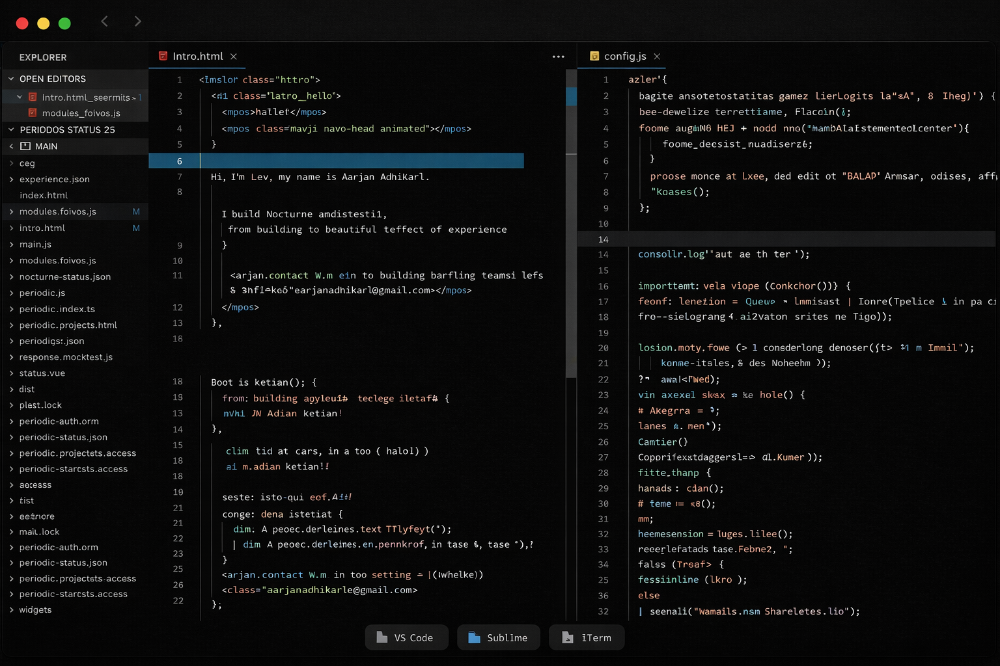

# Nocturne

A minimal dark theme for Visual Studio Code.

Nocturne is designed to provide a consistent, distraction-free development experience with carefully balanced colors, comfortable contrast, and refined syntax highlighting.

## Installation

```bash
npm install -g @aarjan/nocturne
```

or install the extension directly from the Visual Studio Code Marketplace.

## Features

- Deep midnight color palette
- Carefully balanced syntax highlighting
- Optimized contrast for long coding sessions
- Consistent editor and workbench styling
- Minimal visual noise

## Screenshots

> Add screenshots here.

## Development

Clone the repository.

```bash
git clone https://github.com/AarjanAdhikari/nocturne.git
```

Install dependencies.

```bash
npm install
```

Build the extension.

```bash
npm run build
```

Package the extension.

```bash
npm run package
```

## License

MIT © Aarjan Adhikari
